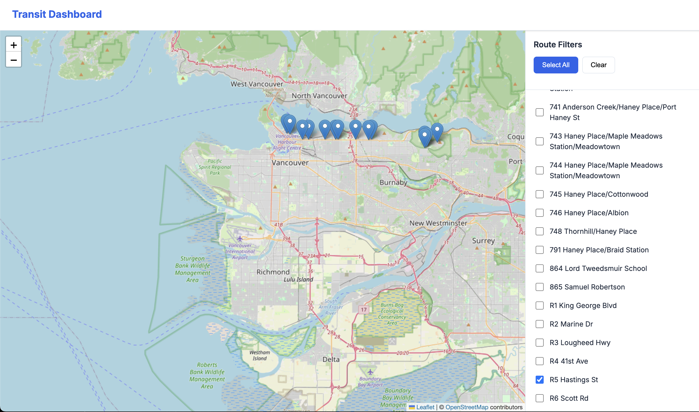

# Transit Data

A collection of scripts and tools for processing, analyzing, and visualizing public transit data (GTFS, Realtime, etc.).

## Stack
- Apache Kafka (entirely unnecessary, but wanted to use it in a project to learn more about microservice architecture with message queues)
- Python
- FastAPI
- React

## Screenshot

## Roadmap
- [ ] Parse realtime data for stop delays, possibly creating a heatmap of delays
- [ ] Create notification system to notify users for when busses are near bus stops
